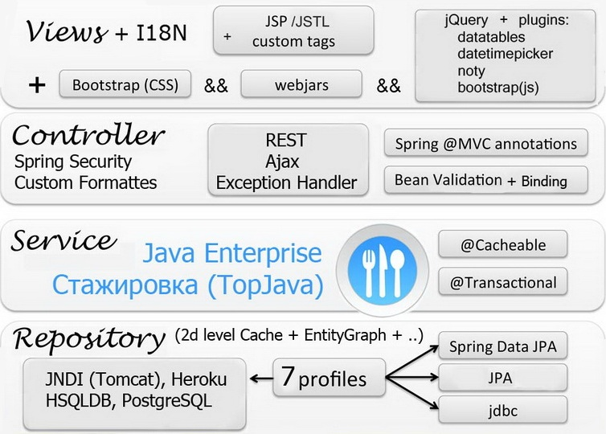

Java Enterprise Online Project
===============================
Разработка полнофункционального Spring/JPA Enterprise приложения c авторизацией и правами доступа на основе ролей с использованием наиболее популярных инструментов и технологий Java: Maven, Spring MVC, Security, JPA(Hibernate), REST(Jackson), Bootstrap (css,js), datatables, jQuery + plugins, Java 8 Stream and Time API и хранением в базах данных Postgresql и HSQLDB.

## <a href="description.md">Описание и план проекта</a>
### <a href="http://topjava.herokuapp.com/" target=_blank>Демо разрабатываемого приложения</a>
### <a href="https://github.com/JavaOPs/topjava/wiki">Требования к участникам, Wiki</a>
### <a href="C:\JavaProjects\calories_managment_app\issues"> Задания для выполнения в папке "issues" </a>
