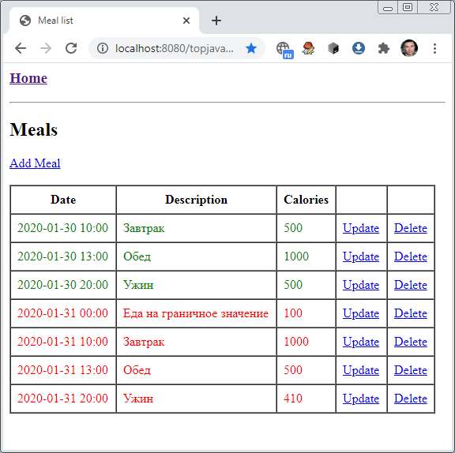
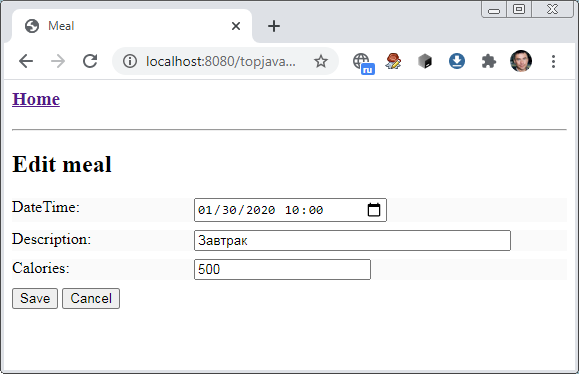

##Стажировка Topjava
###hw Домашнее задание HW01 (делаем ветку HW01 от последнего патча в master)
ОСНОВНОЕ, чему мы учимся на проекте: мыслить и работать как Java разработчики уже сейчас, потом это будет гораздо сложнее и стоить дороже.
Вот на мой взгляд хорошие советы новичкам. От себя я добавлю:

Учись грамотно формулировать проблему. Проблема "у меня не работает" может иметь тысячи причин. В процессе формулирования очень часто приходит ее решение.
что я делаю (подробно, чтобы понял человек, который не копался в этом совсем)
что получаю (обычно верх самого последнего эксепшена)
мои попытки решения проблемы
Учись исследовать проблему. Внимательное чтение логов и умение дебажить - основные навыки разработчика. Обычно самый верх самого нижнего эксепшена- причина ошибки, туда нужно ставить брекпойнт.
Грамотно уделяй время каждой проблеме. Две крайности - сразу бросаться за помощью и биться над ней часами. Пробуй решить ее сам и в зависимости от проблемы выделяй на это разумное время.
Обязательно и как можно чаще пользуйтесь Ctrl+Alt+L - отформатировать код класса
При изменениях на UI не забываетй сбрасывать кэш браузера - Ctrl+F5
При удалении классов не забывате чистить target - в окошке Maven или mvn clean
При проблемах с IDEA пользуйтесь Refresh в окошке Maven
При проблемах с выполнением проверьте (и удалите) лишние java процессы (например в Task Manager)
###1. Реализовать сервлет с отображением в таблице списка еды (в памяти и БЕЗ учета пользователя)
   Деплоиться в Tomcat лучше как war exploded: нет упаковки в war и при нажатой кнопке Update Resources on Frame Deactivation можно обновляться css, html, jsp без передеплоя. При изменении web.xml, добавлении методов, классов необходим redeploy.

###1.1 По аналогии с UserServlet добавить MealServlet и meals.jsp
Задеплоить приложение (war) в Tomcat c applicationContext=topjava (приложение должно быть доступно по http://localhost:8080/topjava)
Попробовать разные деплои в Tomcat, remote и local debug
###1.2 Сделать отображения списка еды в JSP в таблице, цвет записи в таблице зависит от параметра excess (красный/зеленый).
1.2.1 Список еды захардкодить (те проинициализировать в коде, желательно чтобы в проекте инициализация была только в одном месте). Норму калорий (caloriesPerDay) сделать в коде константой
1.2.2 Время выводить без 'T'
1.2.3 Список выводим БЕЗ фильтрации по startTime/endTime
1.2.4 С обработкой исключений пока можно не заморачиваться, мы будем красиво обрабатывать в конце стажировки
1.2.5 Вариант реализации:
из сервлета преобразуете еду в List<MealTo>;
кладете список в запрос (request.setAttribute);
делаете forward на jsp для отрисовки таблицы (при redirect атрибуты теряются).
JSP работает через геттеры: meal.dateTime в JSP вызывает meal.getDateTime()
в JSP для цикла можно использовать JSTL tag forEach. Для подключения JSTL в pom.xml и шапку JSP нужно добавить:
<dependency>
<groupId>javax.servlet</groupId>
<artifactId>jstl</artifactId>
<version>1.2</version>
</dependency>

    <%@ taglib prefix="c" uri="http://java.sun.com/jsp/jstl/core" %>
    ...
Интернет-приложения на JAVA
JSP
Как создать Servlet? Полное руководство
JSTL для написания JSP страниц
JSTL: Шаблоны для разработки веб-приложений в java
JSTL LocalDateTime format

###Optional
###2. Реализуем в ПАМЯТИ (любая коллекция) CRUD (create/read/update/delete) для еды
   Пример: Simple CRUD using Servlet/JSP

Пример нужно САМОСТОЯТЕЛЬНО переделать: вместо хранения в MySql нужно хранить в коллекции ПАМЯТИ (задание упрощается).
Классы: сервлет, инрерфейс хранения, его реализация для хранения в памяти
2.1 Хранение в памяти будет одна из наших CRUD реализаций (позже будет JDBC, JPA и DATA-JPA).
2.2 Работать с реализацией CRUD через интерфейс, который не должен ничего знать о деталях реализации (Map, DB или что-то еще).
2.3 Добавить поле id в Meal/ MealTo. Реализовать генерацию счетчика, УЧЕСТЬ МНОГОПОТОЧНОСТЬ СЕРВЛЕТОВ. В качестве первичного ключа используют UUID, Long, Integer. На нашем проекте будем использовать Integer.
обзор java.util.concurrent
2.4 Сделать форму редактирования в JSP: AJAX/JavaScript использовать НЕ надо, делаем через <form method="post"> и doPost() в сервлете.
2.5 Для ввода дат и времени можно использовать html5 типы, хотя они поддерживаются не всеми браузерами (протестировать свой браузер). В конце курса мы добавим DateTimePicker jQuery plugin, который будет работать на всех браузерах.
2.6 Форму на create-update предлагаю не дублировать, сделать одну (хотя это не ошибка сделать разные).
После выполнения ДЗ обязательно проверьте решение на ошибки
question Вопросы по HW1
Не попадаю на страничку/брекпойнт в сервлете.

внимательно проверь url и applicationContext (Application Context должен быть тот же, что и url приложения: wiki IDEA)
посмотрите в task manager: возможно запущено несколько JVM и они мешают друг другу. Лишние java приложения убить.
Приложение не видит TOPJAVA_ROOT.

После выставления переменной окружения IDEA нужно рестартовать. Слеши в пути должны быть в стиле unix (/). Проверить, видит ли java переменную окружения можно так: System.getenv("TOPJAVA_ROOT"). Еще вариант: добавить -DTOPJAVA_ROOT=... в опции запуска приложения, тогда она доступна из java как System.getProperty("TOPJAVA_ROOT").

Проблемы с кодировкой в POST (кракозябры).

Возможное решение - выставьте кодировку ДО первого чтения из request:

protected void doPost(HttpServletRequest request, ...) {
request.setCharacterEncoding("UTF-8");
Если сервлет тыкают несколько пользователей / несколько браузеров, какого должно быть поведение? Нужно ли что-то делать с сессиями?

В Optional нужно делать реализацию хранения потокобезопасной. Cессии пока не используем (начнутся, когда будет прикручивать авторизацию).

Для чего нам нужна потокобезопасная реализация коллекции, если каждый пользователь видит только себя?

Реализация хранения в памяти у нас одна на всех. Те коллекция шарится между пользователями, они в разных потоках ее дергают. Если несколько потоков одновременно будут изменять коллекцию без учета потокобезопасная (например один будет удалять, второй вставлять), без учета потокобезопасности мы получим ConcurrentModificationException

Предпочтительнее ли создавать новый объект Meal при каждом update?

Если при обновлении не создавать копию, то сохраненный в памяти объект может кто-то попортить. Вопрос скорее доверия к коду- если проект большой и людей над ним трудится много, то вероятнее нужно копировать.

Почему теряются атрибуты при передаче на сервлет: http://localhost:8080/topjava/meals?action=add&... и req.getAttribute("action") = null ?

См. Difference between getAttribute() and getParameter(). Отсюда также следует, что при редиректе атрибуты теряются.

Зачем нужен в jsp <jsp:useBean id=".." scope="request" type=".."/> ?

jsp:useBean нужен IDEA для автодополнений - она понимает тип переменной, которая уже доступна в JSP (например через setAttribute). И еще эта переменная становится доступной в java вставках. Для вывода в JSP это тэг не обязателен. Если тип переменной JSP не совпадает с тем, что в jsp:useBean, будет ошибка.

Итоги занятия после выполнения ДЗ:
Мы создали CRUD веб-приложение для управления едой (создание-чтение-обновление-удаление) с использованием сервлетов и логированием. Пока в памяти, и пока еда никому не принадлежит. Пример выполнения ДЗ (не надо сложного интерфейса, Bootstrap css будем проходить на 8-м занятии):

###error Типичные ошибки
1 Если в названии класса есть Meal, не нужно использовать слово meal в методах класса.

2 Привыкайте писать комментарии к чекину: одной фразой что вы сделали в нем. Например: Meals CRUD implementation. См. Как писать сообщения коммитов

3 Хранение в памяти и операции с ней должны выполняться просто и эффективно

4 Хранить нужно Meal и конвертировать ее в MealTo когда отдаем список на отображение в JSP.
excess нужно пересчитывать каждый раз перед отображением
форматирование должно находится в JSP! Именно он заведует отображением. Повторяем паттерн MVC

5 Стили color можно применять ко всей строке таблицы tr, а не каждой ячейке.

6 DateTimeFormatter можно сделать один заранее (он потокобезопасный в отличие от SimpleDateFormatter), а не создавать новый при каждом запросе.

7 Работать с CRUD надо через интерфейс.

8 Реализаций хранения будет несколько, нужно учитывать это в названии класса имплементации работы в памяти.

9 В web.xml принято группировать сервлет со своим маппингом

10 Не размещайте никакую логику (форматирование, счетчики) в бинах, где хранятся только данные (Meal, MealTo)

11 Еще раз: детали реализации в памяти не должны быть никому видны. Те НЕ НАДО счетчик размещать в Meal или MealServlet или MealsUtil, в базе же он будет по другому генерится.
12 volatile при ++ не помогает от многопоточности. Почему?

13 Обратите также внимание на то, чтобы реализация вашей коллекции для хранения еды была также многопоточной.

14 Не делайте дублирование кода MealsUtil. Простой вариант - использовать то, что отсутствие фильтрации - это частный случай фильтрации (когда ничего не отсеивается). В моем решении используется паттерн стратегия
15 Не дублируйте строки в jsp. Посмотрите на тернарный оператор.

16 После операции delete в браузере должен быть url http:\\localhost:8080\topjava\meals

17 Перед чекином проверяйте свой ченджлист (Ctrl+D на файле из Local Changes - посмотреть что поменялось). Если там только пробелы/переводы строк, не надо его комитить - делайте файлу Git->revert.
18 Учтите в названии реализации CRUD, что

18.1 у нас будет несколько реализаций (не только в памяти)

18.2 у нас будет 2 CRUD (для еды и пользователей). А в реальном проекте их намного больше.

19 Сессии НЕ использовать! При редиректе все атрибуты (req.getAttribute()) теряются (см. вопрос выше). Сценарий редиректа:

1 из сервлета делаем редирект (снова на сервлет, не на JSP!)

2 снова заходим в сервлет

3 кладем нужные атрибуты и делаем forward на jsp

4 если очень хочется передать параметры из 1. в 2. можно сделать их через параметры запроса (например meals?id=5) и доставать через reg.getParameter(id). В моей реализации такого не потребовалось.